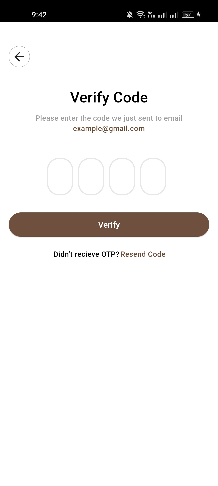
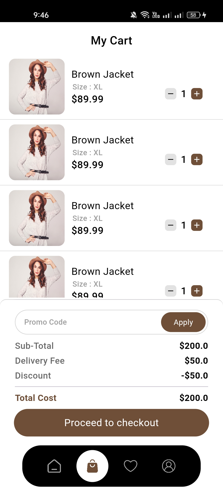
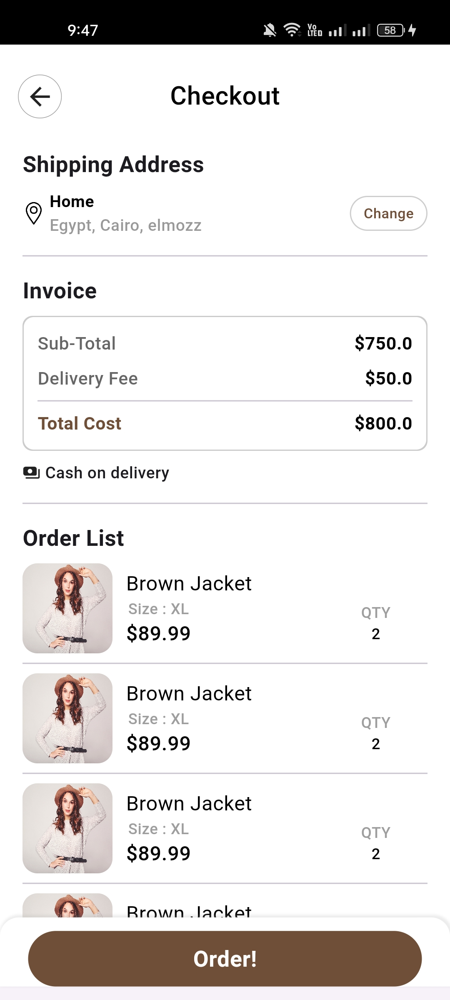
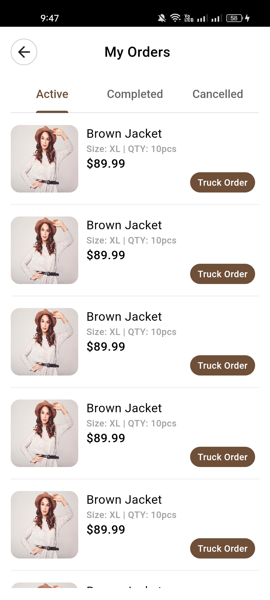
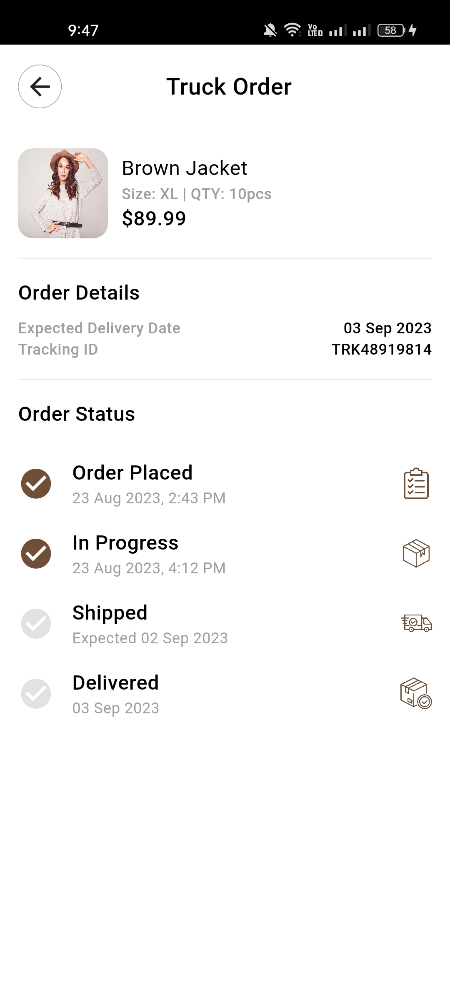
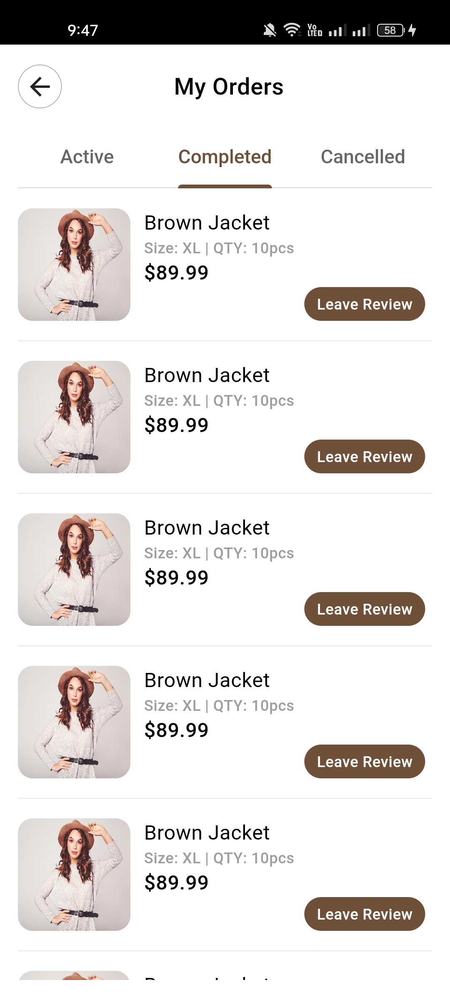
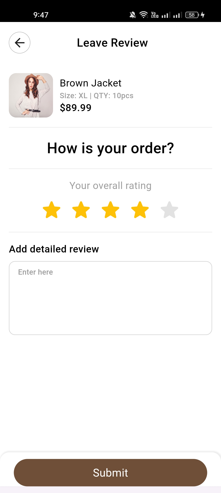
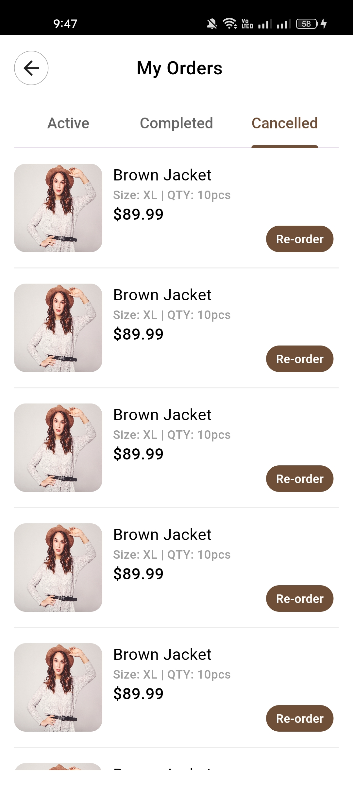
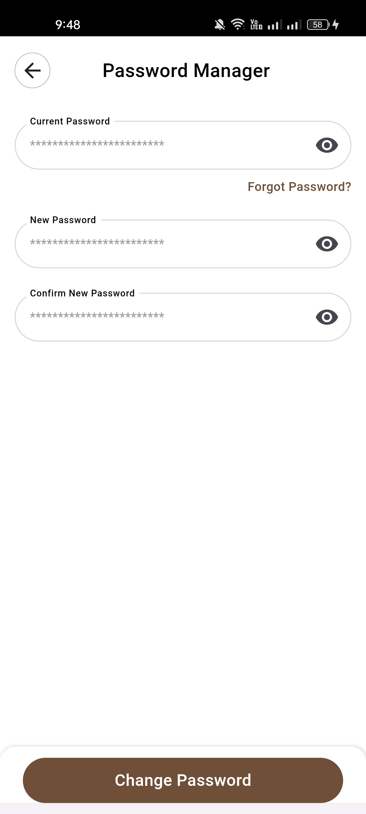
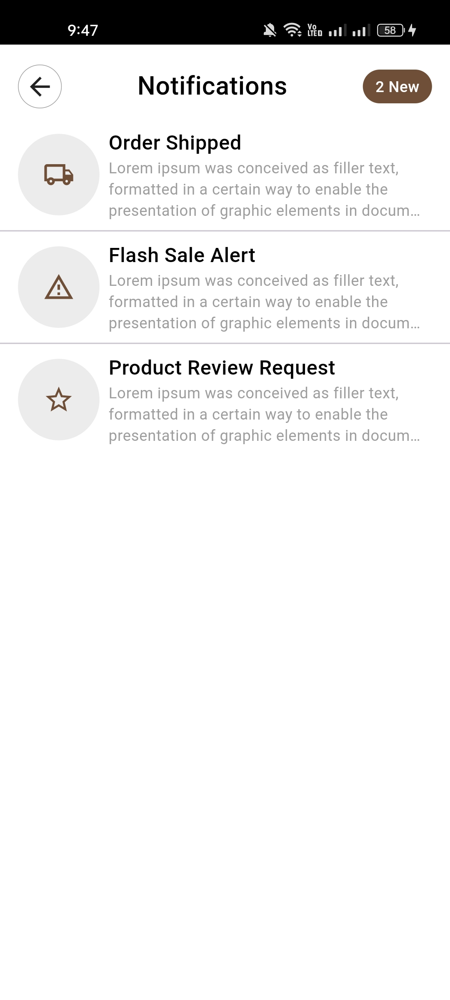

# Fashion E-commerce App
Application for buying and selling clothes and following fashion

## Built using
- Flutter framework
- MVVM Design architecture

## Its advantages
- Responsive UI
- Clean Code
- Easy to adjust colors and fonts
- Ready to integrate with API

## Features

#### Welcome Screen

#### Onboarding
  

#### Auth
 

#### Reset Password
  

#### Main Screen
  

#### Search

#### Category Products

#### Product Details

#### Checkout

#### Orders
    

#### Settings
 

#### Notifications

## Contact us
* What's app: 01021426050

