# Fraufashionista application
Application  purchasing and selling apparel while staying up-to-date with the latest fashion trends.

## Built using
- Flutter framework
- MVVM Design architecture

## Its advantages
- Responsive UI
- Clean Code
- Easy to adjust colors and fonts
- Ready to integrate with API

## Features

#### Welcome Screen
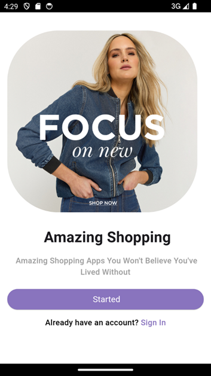

#### Onboarding
 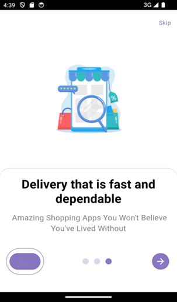 

#### Auth
 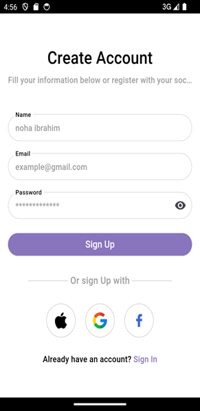

#### Reset Password
 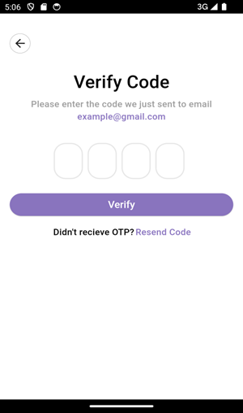 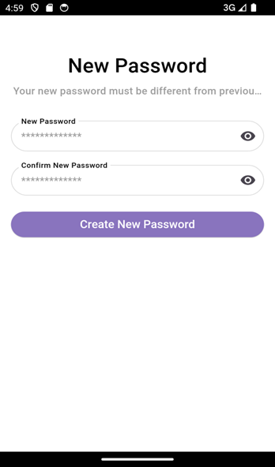

#### Main Screen
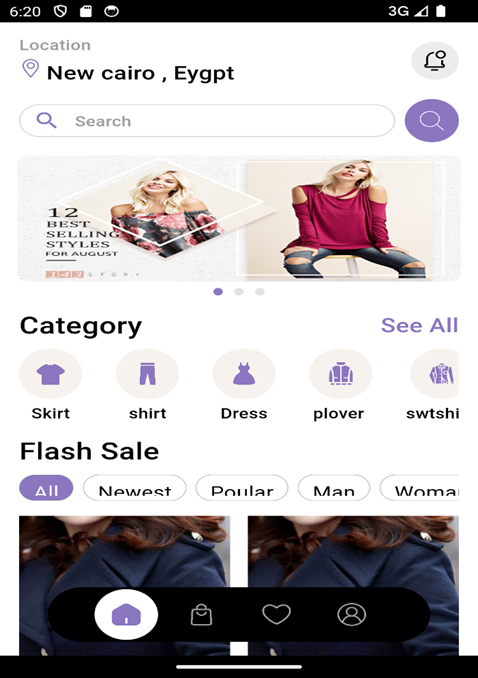 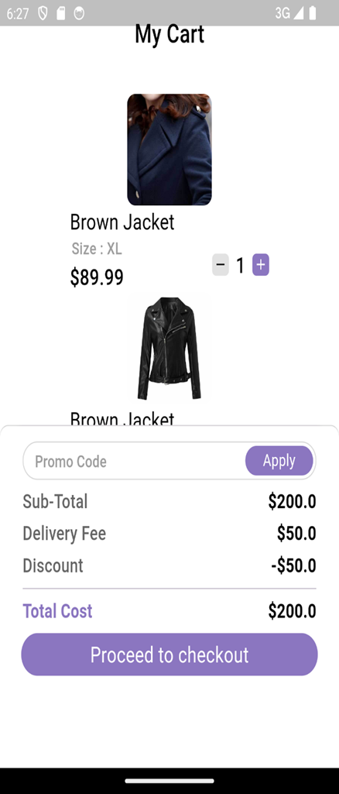 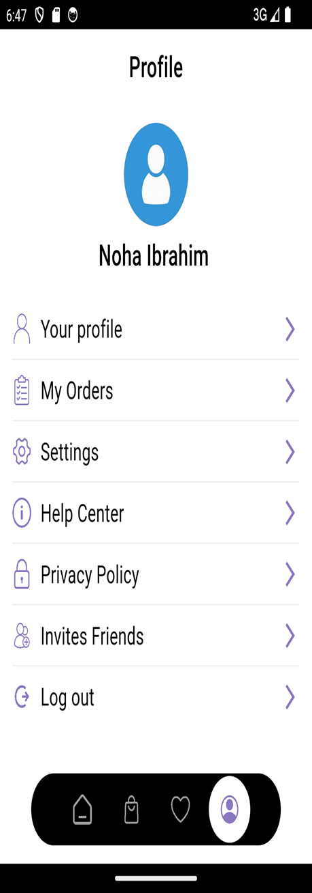

#### Search
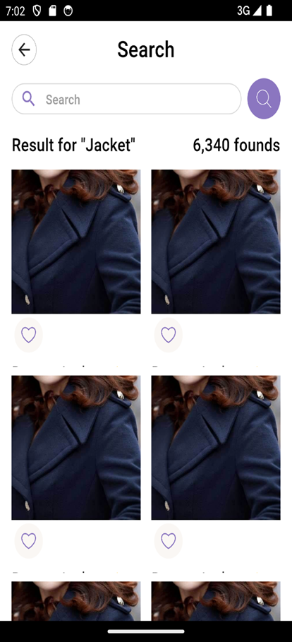

#### Category Products
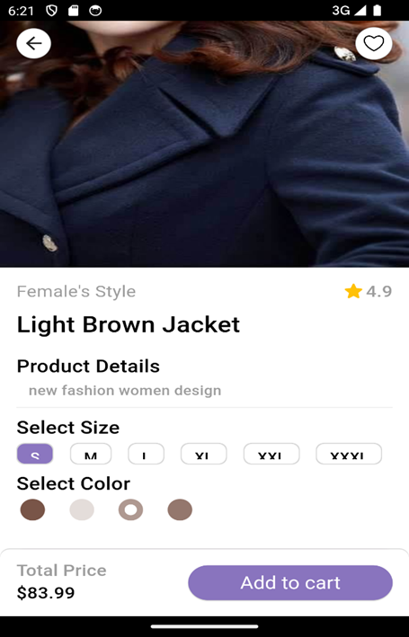

#### Product Details

#### Checkout
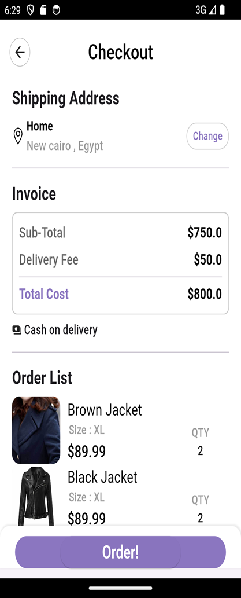

#### Orders
 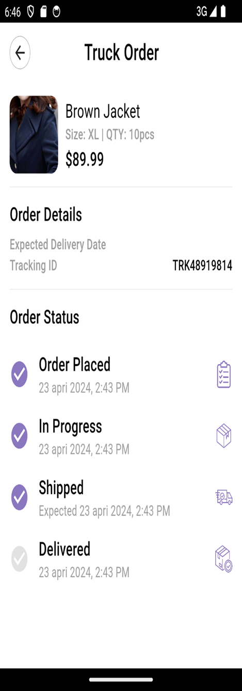

#### Settings

#### Notifications
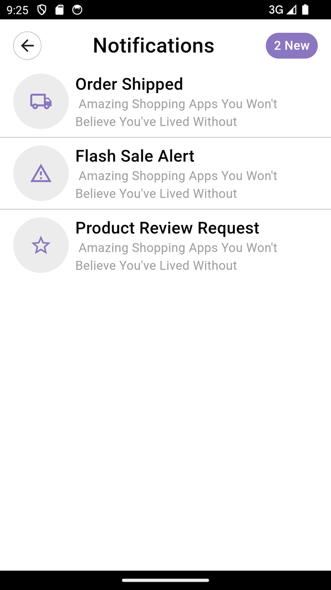

## Contact us
* What's app: 01021426050

